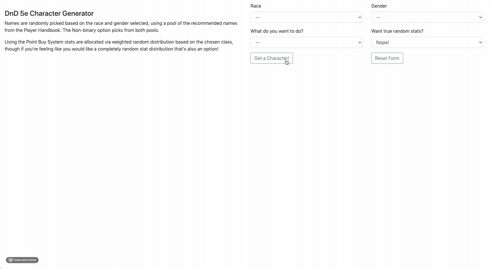

# D&D Character Generator

> This is a front-end React based app for D&D 5e Character Generation designed to provide name generation and weighted random stat distribution for characters either for new players, DMs, or those looking for a jumpstart to character creation.
> Auto-populates a form-fillable PDF character sheet with name, race, class, stats, and stat modifiers, which can be downloaded or printed.

<!-- ## Table of Contents
1. [Usage](#Usage)
1. [Requirements](#Requirements)
1. [Server](#Server)
1. [Development](#Development) -->

## Usage

> Currently developed / used via the live-server plugin for VSCode

<!-- > To run the app locally, spin up the server, either via 'node server/server.js', live-server, or some other method, and navigate to localhost:3000 -->

<!-- ## Requirements -->

<!-- ## Server -->
<!-- > CRUD ROUTES
GET /user
POST /user
POST /user/char -->

## Demo



## Development
From within the root directory, in their own terminals:

```sh
npm run build
live-server //Navigate to client/dist
```
### Installing Dependencies

From within the root directory:

```sh
npm install
```